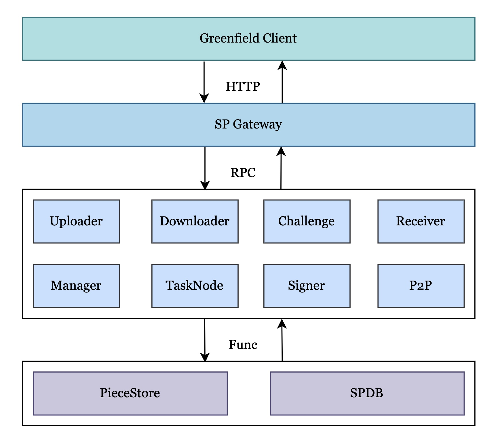

# Overview

## What is the Greenfield Storage Provider

Storage Providers (abbreviated SP) are storage service infrastructure providers.
They use Greenfield as the ledger and the single source of truth. Each SP can and
will respond to users' requests to write (upload) and read (download) data, and
serve as the gatekeeper for user rights and authentications.

## Architecture

<div align=center></div>
<div align="center"><i>Storage Provider Architecture</i></div>

## Concept

### Module

SP consists of a set of modules, these modules is divided into two types, includes:
Common Modules and Customized Modules. 

The Common Modules that must be implemented according to the SP regulations and complete 
the corresponding functions, For example: the authorizer module that checks the account 
have the permission to upload object or download object and other operator, the approver 
module handles the account get create bucket and object approval request, SP can customize 
its own strategy to decide whether to authorize the account itself as the primary SP to 
provide services to the bucket or object, for instance, if the current load of the SP is 
high or the user's credit value is low, it can be rejected.

The Common Modules includes:
* [Authorizer](../../core/module/README.md): Authorizer is the module to authority verification.
* [Approver](../../core/module/README.md) : Approver is the module to handle ask approval request,
  handles CreateBucketApproval and CreateObjectApproval.
* [Uploader](../../core/module/README.md): Uploader is the module to handle put object request 
  from user account, and store it in primary SP's piece store.
* [Downloader](../../core/module/README.md): Downloader is the module to handle get object request
  from user account.
* [Manager](../../core/module/README.md): Manager is the admin module for SP, it is responsible 
  for background task scheduling and global management of SP.
* [TaskExecutor](../../core/module/README.md): TaskExecutor is the module to handle background 
  task, it will ask task from Manager module, handle the task and report the result or status 
  to the manager module includes: replicate piece to secondary SP, seal object on greenfield, 
  confirm the received pieced as secondary SP is successfully sealed on greenfield, delete
  the object payload data that has been deleted on greenfield.
* [P2P](../../core/module/README.md): P2P is the module to the interaction of control information
  between Sps, handles the ask replicate piece approval, it will broadcast the approval to
  other SPs.
* [Receiver](../../core/module/README.md): Receiver is the module to receive the piece data from
  primary SP, calculates the integrity hash of the piece data and sign it, returns to the
  primary SP for sealing object on greenfield.
* [Signer](../../core/module/README.md): Signer is the module to handle the SP's sign and broadcast 
  the tx to greenfield, for example SealObject, RejectSealObject etc. It holds SP all private 
  key. Considering the sp account's sequence number, it must be a singleton.

The Customized Modules
Developers can customize their own modules to achieve customized functions. For example, the
* [MetaData](../../modular/metadata/README.md): supply better query service for the greenfield 
  network. Users can interact with SP for some complex query services. Some interfaces can be 
  costly to implement on the chain or can cause significant latency.

### Service

Service is an independently running process, which can run several modules inside, and the 
communication between modules is completed through Grpc. For example:

```shell
./gnfd-sp --config ./${config_file_path} --service approvaer, approver
```

Default will start all modules in the same process, do not set the '--service' flag.
This design can make SP microservice collocation more free, and modules can be combined 
according to the actual deployment situation.

## Expand SP

* [Infrastructure](../infrastructure/readme.md)

## Explore SP
* [Quick Start SP](../run-book/02-localup.md)
* [Deployment of SP](../run-book/01-deployment.md)
